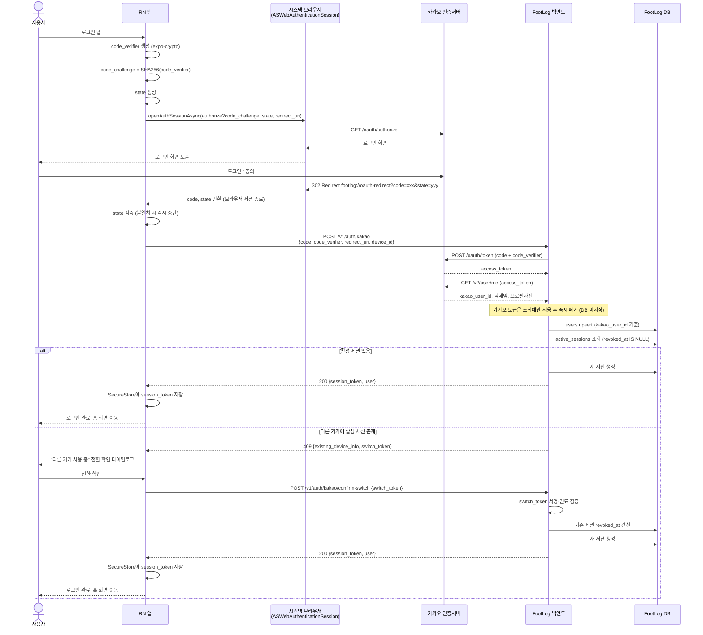

# FootLog 카카오 로그인 PKCE 인증 설계

- 작성일: 2026-08-19
- 상태: 승인됨
- 관계: `docs/superpowers/specs/2026-08-14-server-sync-photo-backup-design.md` 1절이 범위 밖으로 미뤄둔 "카카오 OAuth 검증 절차"를 다룬다. 같은 문서 3절(새 기기 로그인·기기 전환)과 5.1절(`POST /v1/auth/kakao`, `POST /v1/auth/kakao/confirm-switch` 엔드포인트, `users`/`active_sessions` 스키마 스케치)을 그대로 채택하고 확정한다. `docs/product/footlog-prd.md` 14절이 이 설계에 위임한 "카카오 OAuth 흐름, 토큰 저장·갱신과 서버 검증 방식"을 충족한다.
- 우선순위: 제품 범위와 수용 기준은 PRD를 우선한다. 이 문서는 그 수용 기준을 만족하는 인증 아키텍처·API·데이터 모델만 다룬다.

## 1. 배경과 범위

M1~M2는 로그인 없는 로컬 사용자로 동작하며, 백엔드는 `X-Debug-User-Id` 헤더를 그대로 신뢰하는 `HeaderCurrentUserProvider` 스텁으로 사용자를 식별한다. M3부터 카카오 로그인이 추가되며, 이 문서는 다음을 다룬다.

1. 모바일 앱의 PKCE 인가 요청과 딥링크 처리
2. 백엔드의 카카오 토큰 교환과 사용자 정보 조회
3. FootLog 자체 세션 발급·식별 방식과 `CurrentUserProvider` 교체
4. 카카오 동의 항목 범위와 세션 만료 정책

계정 삭제(FR-M3-04), 온보딩 화면 UX, 기기 전환 다이얼로그의 문구·디테일은 각각 별도 설계 문서 소관이며 이 문서에서 다루지 않는다.

## 2. 아키텍처 개요

Public client(React Native 앱)가 PKCE로 카카오 인가 코드만 받아오고, **백엔드가 최종 토큰 교환을 수행**하는 BFF(Backend For Frontend) 구조를 채택한다. 카카오 SDK는 쓰지 않고, 순수 OAuth 2.0 Authorization Code + PKCE(카카오 "REST API 방식")로 구현한다.

이 구조를 선택한 이유:

- 모바일 앱은 바이너리를 디컴파일하면 내부 값을 꺼낼 수 있는 public client이므로 `client_secret`을 안전하게 보관할 수 없다. PKCE는 고정된 비밀 대신 로그인 시도마다 새로 생성되는 `code_verifier`로 인가 코드 탈취 공격을 막는다.
- FootLog는 기기당 단일 활성 세션과 기기 전환(3절 참조)을 서버가 통제해야 한다. 앱이 카카오 토큰을 직접 들고 있는 순수 클라이언트 교환 방식은 이 서버 주도 세션 통제와 맞지 않는다.
- 카카오 공식 문서 자체가 REST API 방식을 "서비스 서버가 토큰을 교환하는 것"으로 전제하고 있어, 이 구조가 카카오가 상정하는 기본 흐름과 일치한다.
- 카카오 `access_token`/`refresh_token`이 클라이언트 메모리에 노출되지 않아 공격 표면이 줄어든다.

## 3. 시퀀스 다이어그램



## 4. 모바일 흐름

1. `expo-crypto`로 `code_verifier`(랜덤 43~128자)를 생성한다.
2. `code_verifier`를 SHA-256 해시하고 base64url 인코딩해 `code_challenge`를 만든다.
3. CSRF 방지용 `state` 랜덤값을 생성하고 메모리에 보관한다.
4. `expo-web-browser`의 `openAuthSessionAsync`로 카카오 인가 페이지를 연다.
   - `https://kauth.kakao.com/oauth/authorize?client_id=...&redirect_uri=footlog://oauth-redirect&response_type=code&code_challenge=...&code_challenge_method=S256&state=...`
5. 사용자가 카카오 로그인·동의를 완료하면 `footlog://oauth-redirect?code=...&state=...`로 리다이렉트되고, `openAuthSessionAsync`가 이 URL을 캡처해 반환한다.
6. 반환된 `state`가 3단계에서 생성한 값과 일치하는지 검증한다. 불일치하면 백엔드 호출 없이 즉시 중단하고 로그인 실패로 처리한다.
7. `POST /v1/auth/kakao`로 `code`, `code_verifier`, `redirect_uri`, `device_id`를 전송한다.
8. 응답 처리:
   - `200`: `session_token`을 `expo-secure-store`에 저장하고 홈 화면으로 이동한다.
   - `409`: 다른 기기의 활성 세션 정보를 담아 전환 확인 다이얼로그를 띄운다. 사용자가 확인하면 `POST /v1/auth/kakao/confirm-switch`를 호출한다.

## 5. 백엔드 흐름 — `POST /v1/auth/kakao`

```
요청  { code, code_verifier, redirect_uri, device_id }

1. 필수 필드 검증
2. POST https://kauth.kakao.com/oauth/token
   grant_type=authorization_code, client_id=<REST_API_KEY>,
   redirect_uri, code, code_verifier
   → access_token 획득
3. GET https://kapi.kakao.com/v2/user/me (Authorization: Bearer <access_token>)
   → kakao_user_id, 닉네임, 프로필사진 획득
4. users 테이블에 kakao_user_id 기준 upsert (최초 로그인이면 생성)
5. active_sessions에서 해당 user_id의 revoked_at IS NULL 세션 조회
   - 없음 → 새 세션 생성, 200 응답
   - 있음(다른 device_id) → 서명된 단기 `switch_token`(user_id, device_id, 5분 만료 클레임 포함) 발급 후 409 응답 + 기존 기기 정보 + `switch_token`
6. 카카오 access_token/refresh_token은 3단계 조회에만 사용하고 저장하지 않음
```

카카오 인가 코드는 1회성이라 4단계에서 이미 소비된다. 따라서 `POST /v1/auth/kakao/confirm-switch`는 `code`/`code_verifier`를 재전송받지 않고, 직전 `409` 응답에 포함된 `switch_token`만 요청 바디로 받는다. 서버는 `switch_token` 서명과 만료를 검증한 뒤 기존 세션의 `revoked_at`을 갱신하고 새 세션을 발급한다. `switch_token`은 DB에 저장하지 않는 무상태(stateless) 서명 토큰이며, 9절의 무기한 세션 정책과는 별개다 — 이 토큰은 전환 확인이라는 좁은 시간창(5분)만 담당한다. 상세 전환 UX는 `2026-08-14-server-sync-photo-backup-design.md` 3절을 따른다.

## 6. 데이터 모델

`2026-08-14-server-sync-photo-backup-design.md` 5.1절의 스케치를 확정한다.

```
users
  id UUID PK
  kakao_user_id TEXT UNIQUE NOT NULL
  nickname TEXT
  profile_image_url TEXT
  created_at TIMESTAMPTZ

active_sessions
  id UUID PK
  user_id UUID FK -> users.id
  device_id TEXT
  session_token TEXT UNIQUE NOT NULL
  issued_at TIMESTAMPTZ
  revoked_at TIMESTAMPTZ NULL
  -- user_id당 revoked_at IS NULL 세션은 항상 최대 1개
```

무기한 세션 정책(9절)에 따라 `expires_at` 컬럼은 두지 않는다. 세션을 끊는 유일한 수단은 `revoked_at` 갱신(로그아웃 또는 기기 전환)이다.

## 7. 인증 미들웨어 교체

`HeaderCurrentUserProvider`(디버그 스텁)를 `SessionCurrentUserProvider`로 교체한다.

- 클라이언트는 `Authorization: Bearer <session_token>` 헤더로 세션을 식별한다.
- 서버는 `session_token`으로 `active_sessions`를 조회하고, 존재하지 않거나 `revoked_at`이 채워져 있으면 401을 반환한다.
- `HeaderCurrentUserProvider`와 `X-Debug-User-Id` 헤더는 운영 코드에서 완전히 제거한다. 테스트는 `active_sessions`에 세션을 직접 만드는 픽스처로 대체한다.

## 8. 카카오 동의 항목 범위

닉네임·프로필사진을 포함한다. `kakao_user_id`만으로는 앱 내에서 사용자를 표시할 수 없으므로, 로그인 시점에 닉네임과 프로필사진 동의를 함께 요청하고 `users` 테이블에 저장한다.

## 9. 세션 만료 정책

FootLog 자체 세션은 무기한 유지되며, 사용자가 명시적으로 로그아웃하거나 다른 기기에서 로그인해 전환될 때만 `revoked_at`이 채워진다. TTL과 리프레시 토큰 교환 로직은 두지 않는다 — 기기당 하나의 활성 세션만 존재하므로 서버가 굳이 주기적 재로그인을 요구할 이유가 없다는 판단이다.

## 10. 에러 처리

| 실패 지점 | 처리 |
|---|---|
| `state` 불일치 | 앱이 백엔드 호출 전에 즉시 중단, 로그인 실패로 안내 |
| 카카오 토큰 교환 실패 (잘못된/만료된 `code`, `code_verifier` 불일치) | 400, 사용자에게 재시도 안내 |
| 카카오 사용자 정보 조회 실패 | 400, 사용자에게 재시도 안내 |
| 카카오 API 타임아웃/5xx | 502, 재시도 유도 |
| 만료된 세션 토큰으로 API 호출 | 401, 앱이 로그인 화면으로 리다이렉트 |

## 11. 미확정 사항 — 구현 시 확인 필요

카카오 개발자 콘솔이 커스텀 스킴(`footlog://oauth-redirect`)을 `redirect_uri`로 그대로 허용하는지는 실제 콘솔 등록 시점에 검증이 필요하다. 허용되지 않으면 백엔드가 짧은 HTTPS 리다이렉트 페이지(예: `https://api.footlog.app/v1/auth/kakao/callback`)를 호스팅해 커스텀 스킴으로 다시 튕겨주는 방식으로 대체한다. `StubObjectStorageClient` 사례처럼, 확정 전까지는 이 부분을 구현 계획 문서에 알려진 한계로 명시한다.

## 12. 범위 밖

- 계정 삭제(FR-M3-04)의 상세 흐름
- 온보딩 화면 UX (환영 화면, 권한 안내 순서 등)
- 기기 전환 다이얼로그의 정확한 문구·디자인
- 분석 이벤트와 개인정보 최소 수집 정책의 세부 항목

## 13. 테스트 전략

- 백엔드: `KakaoOAuthClient` 인터페이스와 테스트용 Stub 구현체로 카카오 토큰/사용자정보 API를 모킹한다. 정상 로그인, 토큰 교환 실패, 기기 전환(`409` → `confirm-switch`) 시나리오를 통합 테스트로 검증한다.
- 모바일: PKCE `code_challenge` 계산 함수, 딥링크 파싱(`code`/`state` 추출), `state` 불일치 처리 로직을 유닛 테스트로 검증한다.
